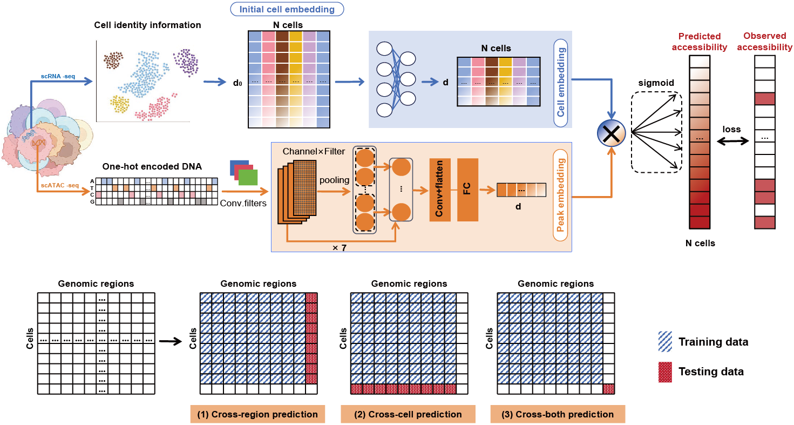

# **XChrom：a cross-cell chromatin accessibility prediction model integrating genomic sequences and cellular context**

## **Brief Introduction**

**XChrom** is a multimodal deep learning framework for genome-wide cross-cell chromatin accessibility prediction. It integrates genomic sequence and single-cell transcriptomics–derived cell identity into a unified model, enabling XChrom to predict chromatin accessibility probabilities for genomic sequences in cell types that are similar—but not identical—to those observed in training.

This repository provides the original code and scripts used for the analyses of **XChrom: a cross-cell chromatin accessibility prediction model integrating genomic sequence and cellular context**. The analyses are organized into four parts:

---

#### **1. `1_within_sample/`**

This directory contains implementations of the three within-sample prediction tasks:

* **Cross-region:** comparison of XChrom with **scBasset**.
* **Cross-cell:** comparison of XChrom with methods such as **Seurat**, **LS_Lab**, and **MultiVI**.
* **Cross-both:** performance evaluation of XChrom (unique capability).

using the **m_brain** dataset as an example.

---

#### **2. `2_cross_samples/`**

This directory includes cross-sample prediction analyses, comparing XChrom with other methods (Seurat, LS_Lab, MultiVI).

* Demonstrated using the **s1d1–s2d1** dataset.

---

#### **3. `3_cross_species/`**

This directory contains cross-species analyses, including:

* Training and prediction with XChrom
* Example interpretability analysis for peak near **PSEN1** with ISM calculation
* TF-motif activity estimation

---

#### **4. `4_covid19/`**

This directory provides XChrom analyses on COVID-19 datasets, including:

* Training XChrom on healthy PBMCs (PBMC10k)
* Predicting TF-motif activity in COVID-19 samples
* Differential TF-activity analyses between **R1 (and R4)** and other monocyte subclusters
* Motif-enrichment analysis for **C1 (and C4)** in COVID-19 independent scATAC-seq dataset
* TF-activity differences between **severe** and **mild** cMono samples

#### `box_plot/`
This directory contains:

- Statistical tests used for comparisons between different groups  
- Code for generating box plots used in the figures

---
## **Model evaluation**

Since XChrom predicts binarized chromatin accessibility (with sequencing count ≥ 1 as the true label), auROC and auPRC are the primary evaluation metrics for the model's discriminative ability. These metrics were calculated at three levels:                  
(i)	overall metrics: calculated across all test cells and peak regions;                               
(ii)	per-peak metrics: calculated for each peak region across test cells, then averaged over all test peak regions;             
(iii)	per-cell metrics: calculated for each cell across all test peak regions, then averaged over all test cells.                
We also adopted NS and LS to evaluate the cell identity fidelity of raw and denoised scATAC-seq data. Both metrics were calculated using KNN graphs at different neighborhood scales (k=10, 50, 100), which were constructed in PCA-reduced space.                    
(i)	NS: Independent KNN graphs were constructed using paired scRNA-seq and scATAC-seq data, respectively. NS quantifies the percentage of overlapping neighbors for each cell between the two graphs.                                                          
(ii)	LS: For a given KNN graph of scATAC-seq data, LS quantifies the percentage of a cell's neighbors that share the same cell-type label within the neighborhood. Since ground-truth cell types were unavailable for some datasets, Leiden clusters derived from scRNA-seq data were used as proxy cell-type labels.                                

## **Download data**

The processed datasets are publicly available and can be downloaded from Zenodo (DOI: https://doi.org/10.5281/zenodo.16959682)  

## **XChrom tutorial**

https://xchrom.readthedocs.io/en/latest/